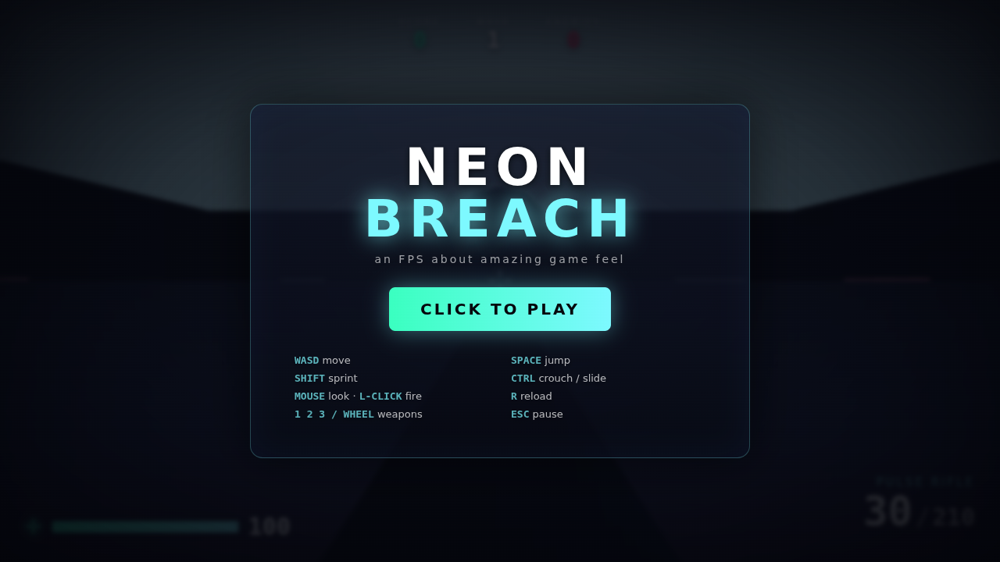
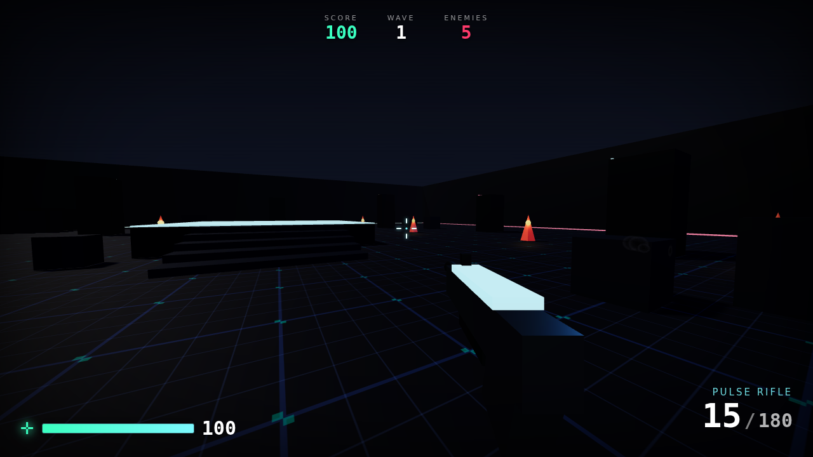

# NEON BREACH

A browser-based first-person shooter built around one goal: **amazing game feel.**
No engine, no build step — just Three.js and vanilla JavaScript modules. Open it
and play.



## Play

It needs to be served over HTTP (ES modules don't load from `file://`):

```bash
npm start          # serves on http://localhost:8080  (zero dependencies)
# or any static server, e.g.:  python3 -m http.server 8080
```

Then open **http://localhost:8080** and click **PLAY** (this grabs your mouse).

> Three.js is vendored in `vendor/` so the game runs **fully offline**.



## Controls

| | |
|---|---|
| **WASD** | move |
| **Mouse** | look · **Left click** fire |
| **Space** | jump (coyote-time + jump-buffer + variable height) |
| **Shift** | sprint |
| **Ctrl / C** | crouch · **sprint + crouch** = slide |
| **R** | reload |
| **1 / 2 / 3 / wheel** | switch weapons |
| **Esc** | pause |

Survive escalating waves of enemies. Score points, chain kills, don't die.

## What makes it *feel* good

Game feel is the sum of a hundred small responses. The big ones here:

- **Movement** — Quake/Source-style explicit ground/air acceleration with
  friction + stop-speed for crisp starts and stops, air-strafe acceleration
  (strafe-jumping builds speed), coyote time, jump buffering, variable jump
  height, and a momentum-preserving crouch-slide.
- **Camera** — head bob tied to speed, a two-stage recoil (snappy kick → smooth
  recovery), dynamic FOV (sprint + per-shot punch), strafe lean/roll, and a
  sprung landing dip.
- **Weapons** — three guns with distinct feel, hitscan with spread *bloom* that
  grows while spraying and recovers when controlled, viewmodel rendered in a
  separate overlay pass so it **never clips into walls**, muzzle flash, tracers,
  brass, and per-weapon recoil.
- **Impact** — **hit-stop** (a few ms of time-freeze on every hit), trauma-based
  screen shake, hit markers (with head-shot + kill variants), white enemy
  hit-flash, knockback, blood spray, floating damage numbers, and a meaty death
  pop + particle burst.
- **Enemies** — two archetypes (melee *Grunt*, ranged *Shooter*) that telegraph
  attacks, steer around cover, and separate from each other.
- **Audio** — every sound is **synthesized procedurally** with the Web Audio API
  (no audio files): guns, impacts, footsteps, hit markers, enemy sounds, UI, and
  an evolving ambient music bed.
- **Juice** — dynamic crosshair, damage vignette with a directional hit
  indicator, low-health pulse, combo counter, wave banners, and kill popups.

## Project layout

```
index.html            entry + importmap
styles.css            HUD / menu styling
server.js             zero-dep static server
vendor/               three.js (vendored for offline use)
src/
  main.js             bootstrap, game loop, state machine, hitscan
  engine/
    math.js           damping, easing, rng helpers
    input.js          keyboard/mouse + pointer lock
    audio.js          procedural Web Audio synth
    fx.js             particles, screen shake, hit-stop, tracers, decals
  player/
    controller.js     movement physics + collision
    camera.js         view feel (bob, recoil, FOV, dip, shake)
  weapons/
    weapon.js         weapons, viewmodels, firing, reload
  world/
    level.js          arena geometry, lighting, colliders
  enemies/
    enemy.js          enemy AI + wave manager
  ui/
    hud.js            HUD, crosshair, popups, menus
```

## License

MIT
