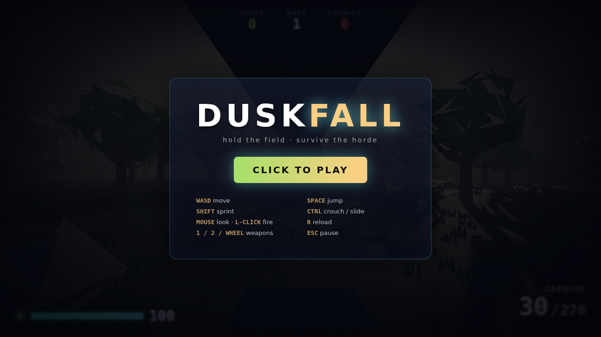
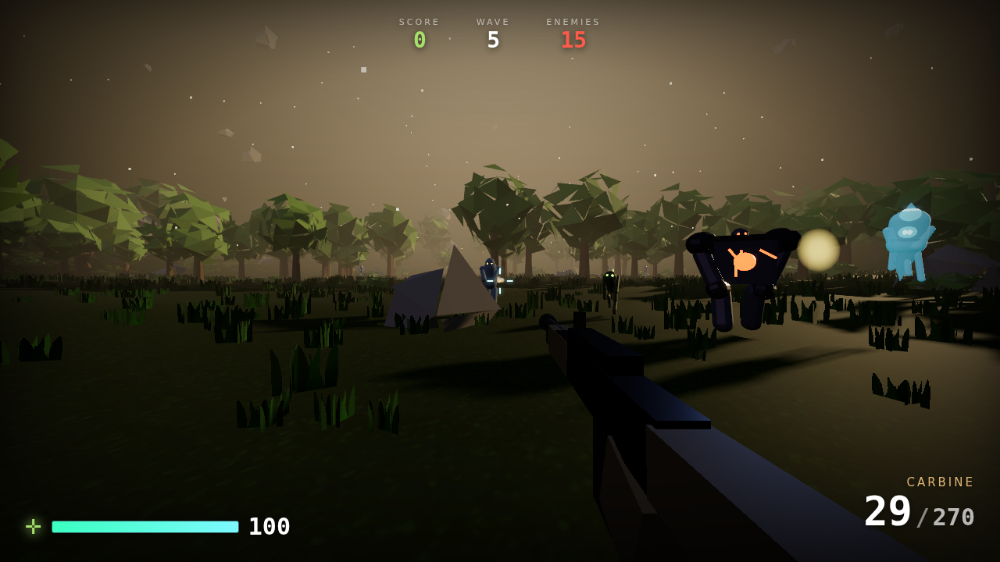

# DUSKFALL

A browser-based horde-survival FPS set in one golden-hour meadow. Run the field,
chain kills, and hold back wave after wave of the advancing horde. Built around a
single goal: **stylish, atmospheric 3D that plays like the smoothest shooter you've
ever touched.** No engine, no build step — just Three.js and vanilla JavaScript
modules. Open it and play.



## Play

It needs to be served over HTTP (ES modules don't load from `file://`):

```bash
# from this folder:
python3 -m http.server 8080
# …or any static server
```

Then open **http://localhost:8080** and click **CLICK TO PLAY** (this grabs your
mouse).

> Three.js and its post-processing addons are vendored in `vendor/` so the game
> runs **fully offline** — no CDN, no network.



## Controls

| | |
|---|---|
| **WASD** | move — you're **always running** at full speed |
| **Mouse** | look · **Left click** fire · **Right click** aim (iron sights) |
| **Space** | jump — press again in the air for a **high double jump** |
| **Shift / F · Mouse4/5** | **dash** — a fast i-frame lunge on regenerating charges; in the air it lifts you, so you can chain jumps + dashes to soar. **Dash into an incoming snowball to bat it back.** |
| **Q / middle-mouse** | **slow-mo** — bend time from a regenerating meter (deadly in the air) |
| **the sky-islands** | jump + air-dash up to the floating islands; brush a ledge and you **mantle** straight up onto it, no stall |
| **Ctrl / C** | crouch · **run + crouch** = slide |
| **1 / 2 / wheel** | switch weapons (carbine · fast combat shotgun) |
| **Esc** | pause |

**There is no reload.** DOOM-style: your ammo only comes from what enemies drop and
from **dash finishers**, so you have to stay aggressive to stay armed and alive.

**On mobile** it auto-switches to touch controls: a floating left-stick to move,
drag the right side to look, and on-screen **FIRE / JUMP / DASH / AIM / pause** buttons.

Survive escalating waves. Score points, chain your combo, don't die. Your best run
is saved locally and shown on the menu.

## The look

DUSKFALL goes for *stylish realism* — a warm, cinematic late-afternoon rather than
a photo. The whole scene is generated at load, then run through a filmic camera:

- **Atmospheric-scattering sky** (Preetham model) with the sun sitting low and
  golden, driving a matching warm directional key light, a cool sky-fill
  hemisphere, and a soft bounce.
- **Procedural terrain** — rolling noise-based hills you can actually walk, ringed
  by a forest that hems in the arena. Grass, dirt and rock are blended by slope and
  height, with alpha-tested grass tufts and a subtle detail texture.
- **Instanced foliage** — hundreds of low-poly trees, rocks and bushes scattered
  with a density that thins toward the middle and thickens into a treeline, drawn
  in a handful of instanced draw calls.
- **Floating sky-islands** — chunks of the meadow torn loose and hovering, grass on
  top and a craggy, crystal-lit underside. They read as native to the world (and
  tint through the seasons with the ground), give the air game somewhere to go, and
  double as **one-way platforms** you can mantle onto.
- **A filmic pipeline** — everything renders into an HDR multisampled buffer, gets
  a restrained bloom on genuinely bright highlights (the sun, tracers), then ACES
  tone-mapping and sRGB output. Hazy fog, drifting dust motes, and long shadows sell
  the golden hour.
- **The viewmodel** is drawn in a separate depth-cleared overlay pass so the gun
  never clips into the world — a hallmark of a polished FPS.

## Seasons & dread

The meadow doesn't stay golden. As you climb the waves the world **turns through
the year and slowly rots** — a little more each level, and it never resets mid-run:

- **Summer → autumn → winter.** The sky thickens and cools, the sun sinks and pales,
  the fog draws in, and the foliage shifts from summer greens to burnt autumn golds to
  a bleached winter. Snow creeps down onto every upward-facing surface (a GPU normal
  mask, so it costs nothing), the grass dies back, and eventually **snow falls** across
  the whole field, thickening into a **storm** by the final stretch.
- **The haunting.** Underneath the season, the light curdles — key light dims, the fog
  turns sickly, exposure drops — so the same meadow that felt warm at wave 1 feels
  wrong and cold by the end.
- **Adaptive audio.** There was no music before; now a layered score runs under the
  whole game — a drone bed, a tension shimmer, and a combat pulse that swells with the
  danger on screen (enemy count, bosses, low health) and whose **mood darkens with the
  season**. Enemy voices are pitched per creature type so a crowd sounds like a crowd,
  and the weapons hit with punchier, layered reports.

## The feel

Game feel is the sum of a hundred small responses. The big ones here:

- **Movement** — Quake/Source-style ground/air acceleration on a rolling heightfield.
  You're **always running** at top speed, with strong air-strafe control, coyote time,
  jump buffering, a variable-height jump, and a momentum-preserving crouch-slide.
- **Air game** — this is the star. High jumps plus a big **double jump**, and a dash
  that runs on **two regenerating charges** and, in the air, **launches you upward**.
  So you can chain **jump → air-dash → air-dash** to soar high and float clear across
  the field — a long, expressive, weightless traversal that turns every fight into a
  movement playground.
- **Dash & jump-dash** — a fast lunge in your move direction (ground *or* air) with
  brief **i-frames**, a big FOV punch, camera roll, radial speed-lines, a whoosh and
  a dust kick. On the ground it hops you forward; in the air it lifts and carries you.
  It's a dodge, a traversal tool, *and* a weapon.
- **Dash strike & finishers** — dashing **through** enemies smashes them: a shockwave
  ring, blood, heavy knockback and a per-body hit-stop, and you can carve through a
  whole crowd in one lunge (i-frames keep you safe). Catch one that's **low on health**
  and it's a **FINISHER** — a gold flash, slow-mo, bonus points, and (crucially) a
  refill of **ammo + health**. Aggression is how you sustain.
- **No reload — feed on the horde** — there's no magazine and only a trickle of passive
  regen. Every weapon draws from one pool that refills from enemy **ammo/health drops**
  (adaptive: more health when you're hurt) and from dash finishers. Glowing pickups
  magnetise into you. Push forward or run dry.
- **Iron sights** — hold right-click to bring the gun up, zoom in, tighten your spread
  and steady your aim (it drops you to a walk and calms the bob). Raising sights breaks
  your run; dashing breaks your sights.
- **Gunplay** — hitscan with spread "bloom" that grows while you fire and move. Every
  shot drives recoil, an FOV punch, screen shake, a muzzle flash + light, a tracer,
  spark burst and a spinning brass casing. Headshots hit harder. Carbine + shotgun.
- **Impact** — enemies flash on hit, snap back, spray signature-coloured blood, and
  crumple through a scripted death. Meaty hits trigger a micro hit-stop; wiping out a
  threat dips the world into a brief kill slow-mo (which the real-time dash cuts right
  through — you glide past frozen enemies).
- **Arcade scoring** — a combo multiplier climbs as you chain kills without missing,
  headshots and finishers pay bonuses, and clearing a wave pays out.

## The horde

Waves drip-spawn from the treeline and close on you from all sides. Five wildly
distinct creatures — each its own silhouette, size, signature colour, glowing
emissive accents (so you read them at a glance and they pop against the dusk),
signature-coloured blood, and its own gait and behaviour:

- **Husk** — ashen foot-soldier with amber eyes. The steady marcher; the backbone
  of every wave.
- **Stalker** — small, fast, hunched raptor-thing lit toxic green. Weaves as it
  runs and lunges the last few metres.
- **Juggernaut** — a towering charcoal tank with a molten-red core and cracks.
  Slow and relentless; the ground shakes when it walks and shrugs off knockback.
- **Wisp** — a legless hovering specter glowing cyan. Bobs and drifts over the
  terrain, unravelling into light when killed.
- **Bloater** — a bulbous pustular sack glowing orange. Waddles in and **ruptures**
  on death in a second, larger burst.
- **Raven** — a dark-violet carrion bird with swept, magenta-lit wings. It **flies**,
  climbing to the sky-islands and diving at you — so getting airborne is no escape.
- **Seer** — a hovering violet caster that holds a high **standoff and snipes** you
  with charged bolts from above (its eye glows as it winds up — read it and dodge).
  Perches by the islands after the first few levels.

The roster unlocks and its mix ramps as the waves climb. A **pressure spawner**
keeps a steady crowd bearing down on you and refills it as you cut them down, so
the action never sags into a lull. When only one enemy is left it goes **berserk**
— faster, hitting harder, charging straight at you, and marked by a tall glowing
beacon you can spot across the whole field, so you never have to hunt the last
straggler.

## Bosses


Every fifth wave the horde parts for a **boss**:

- **THE COLOSSUS** — a five-metre molten titan with an exposed glowing core, horns
  and shoulder spikes, wrapped in lava cracks. It stomps the ground (each footfall
  shakes the screen), winds up a telegraphed **ground-slam** with an area shockwave,
  and periodically **calls in reinforcements**. A dedicated health bar tracks it.
- **THE YETI** — the deep-winter finale. A **seven-metre frost titan** of shaggy
  fur and ice shards that arrives in a **whiteout blizzard** (it whips the storm up
  itself). It hurls **giant snowballs** on a telegraphed wind-up, slams anyone who
  closes in, and summons **ravens** to hound you from the sky. The trick: **dash into
  an incoming snowball to bat it back** — a reflected snowball rockets home and
  **staggers it for massive damage**. Guns alone are slow; the reflect is how you win.

Dodge the slam with your dash i-frames, chip a boss down (their high health shrugs
off a finisher), and when one falls it goes out in a chain of explosions, a slow-mo
beat, a huge score payout, and a pile of guaranteed ammo + health. Their health
scales up each time you meet one.

## Structure

```
index.html          importmap + canvas + boot
styles.css          HUD / menu styling
src/
  main.js           game loop, wiring, arcade scoring
  engine/           input, audio, math, FX (particles/shake/hitstop/slow-mo)
  gfx/post.js       HDR + bloom + tone-map composer
  world/            terrain, instanced foliage, sky + lighting + motes
  player/           terrain-following controller + camera rig
  weapons/          weapons + procedural viewmodels
  enemies/          procedural humanoid horde + wave manager
  ui/hud.js         HUD, menus, score pops, wave banners
vendor/             Three.js + addons (vendored for offline play)
```

No dependencies to install, no bundler, no framework. Just open it and hold the
field.
